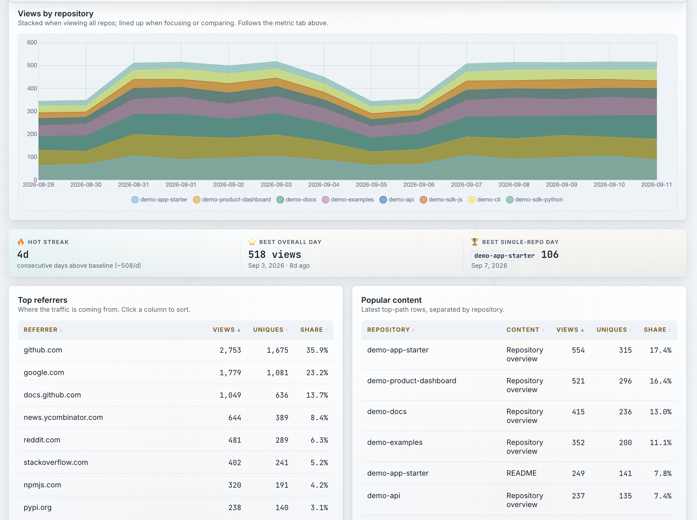
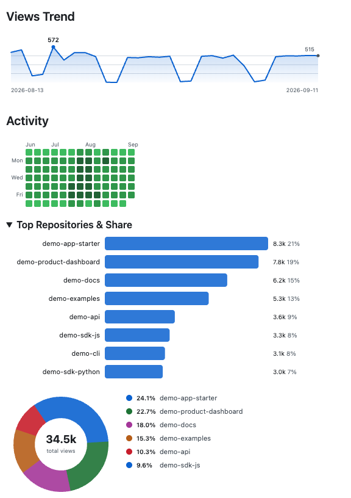

# The Reponomics Dashboard Project

   

      

   

> [!NOTE]
> The Reponomics Dashboard is being developed in public, but is not ready for general public use as of yet. If you are interested in the project, and would like to contribute, or join our beta group of early adopters, you can find more information below.

### _Your dashboard is waiting..._

The Reponomics Dashboard is an open source project built to provide GitHub maintainers with a repository analytics dashboard and growth plaform.

### Core Features

#### Repository Data - Collected, Aggregated, and Stored

Choose which repositories you want to track, and the Dashboard workflows do all the rest. Data is collected from the GitHub REST API using credentials that you own and maintain, and then stored in CSV format.

**Data Collected**

| | |
| --- | --- |
| Traffic | Clones ⋄ Viewers ⋄ Views ⋄ Top Referring Sites ⋄ Most viewed pages |
| Growth | Stars ⋄ Forks ⋄ Watchers  |
| Maintenance | Commit actvity ⋄ Issues ⋄ PRs ⋄ Releases |
| Derived | Aggregate across repos ⋄ Watch trends over time |

**Insights**

Personalized insights identify patterns or anomalies present in your data, and surface these as actionable insights to help you achieve your goals as a builder and maintainer.

**Resources**

Resources are available on a range of topics to helpyou grow and maintain your projects, whether you are just getting started, trying to grow your user base, or improve your supply chain security.

#### HTML Dashboard

<picture>
  <source media="(prefers-color-scheme: dark)" srcset="./docs/assets/dashboard-screenshot-dark-01.png">
  <source media="(prefers-color-scheme: light)" srcset="./docs/assets/dashboard-screenshot-light-01.png">
  
</picture>

 

#### README Dashboard

<picture>
  <source media="(prefers-color-scheme: dark)" srcset="./docs/assets/readme-dashboard-dark-01.png">
  <source media="(prefers-color-scheme: light)" srcset="./docs/assets/readme-dashboard-light-01.png">
  
</picture>

 

### Core Principles

These principles have had a strong impact on the design of this project.

(i) _User sovereignty_ over the dashboard data. Reponomics has no interactions with the user's data whatsoever, and neither does any other party besides GitHub (who provides the data).

(ii) _Premium-quality dashboard experience_ built entirely using resources that GitHub provides to every user free of charge.

(iii) _Privately accessible dashboard on a publicly accessible site_, using robust encryption protocols to ensure privacy, instead of a subscription or app installation.

(iv)  _Keep data storage separate from Git_, using GitHub's workflow artifact storage system for persistence instead.

(v) _Public verification instead of personal trust_. Reponomics does not make any promises, and we don't ask users to trust us - instead, we build open source software according to high standards of supply chain security.

(vi) _Maximum convenience_ for user/owners who prefer it, _maximum configurability_ and control for those who adopt a stricter operational posture; the core product is a personal dashboard, but owning one should not feel like maintaining another project of your own.

(vii) __. The Reponomics Dahboard is designed to make it really, really hard for a user/owner to unintentionally expose their repo data simply due to a Dashboard configuration oversight.

We try to design things so that a Dashboard repo feels more like an app than a codebase, and we do not expect users to have any advanced knowledge of GitHub maintenance. 

## Who This Project is Designed For

I. **First-time GitHub repository owners**: Get an overview of your early progress and access resources to help you advance quickly as a maintainer

II. **Solo founders and indie devs**: Track growth metrics and traffic data as you launch products and apps, and get insights into what's working well and resources to help grow your userbase

III. **Open source maintainers**: Stay on top of your projects and monitor issues, PRs, and engagement, and access resources for maintaining and achieving high standards for OSS projects

IV. **Everybody**: We try to design the product so that it can be useful to any GitHub maintainer; even if you decide not to host a Dashboard, having an easy, convenient way to collect and store your repository data is independently valuable

## Quick Start

If you're ready to get started with your own personal Dashboard repo:

i) Head over to the [Reponomics Dashboard Template Repository](https://github.com/reponomics/reponomics-dashboard) \
ii) Click "Use this template" in the upper right corner > "Create a new repository" \
iii) Select a name for your new repo, and choose visibility "Public" or "Private" \
iv) Edit `config.yaml` and choose which repos you want to track - you can track as many as you want \
v) Enable GitHub Pages to host your dashboard \
vi) Generate your encryption key (`openssl rand -hex 32`) and store it as a repository secret \
vii) Generate a Personal Access Token and store it as a secret \
viii) Run the Setup workflow \
ix) Run the Collect-and-Publish workflow to get your first day of data \
x) Go visit your GitHub Pages site and start exploring!

## Product Structure

The Dashboard consists of two interconnected products:

1) **The Reponomics Dashboard Action** - a GitHub composite action that provides the core functionality for the Dashboard. That includes: collection (gathering repo data from the GitHub API); storage (persising dashboard data into the repository's workflow artifact database); encryption/decryption, for users who opt for "encyrpted mode"; rendering and publication of the data dashboard to GitHub Pages and/or the repository README.

2) **The Reponomics Dashboard Template Repo** - a template repository that ships with workflows that integrate with the Dashboard Action to coordinate the daily collection rounds, dashboard publication, and other repository upkeep tasks.

The current repo (`reponomics/reponomics-dashboard-action`) is responsible for maintaing and publishing these public products, and it is where development work is conducted. If you are a user/owner, this repository is where you may report any issues or suggest enhancements. It is also where you can inspect the repository's security posture and review the supply chain.

In addition, the Dashboard project encompasses:

3) **The Reponomics Dashboard Demo** - A public demo repository where you can preview what a Reponomics Dashboard repo looks like. It varies from the distributed Dashboard template repo in the minimal ways needed to create a public demo: the encryption model is the same, with the "minor" difference that the encryption key is published on the "unlock" page, and the data is purely synthetic.

4) Various staging repos

## Privacy and Security

> [!WARNING]
> The privay and security model is ***strictly dependent*** upon the user/owner's _own_ encryption secret, which is expected to be a 32-byte high-entryopy random key - keys generated by any method besides the ones that we describe (or ones known to be equally reliable) offer _little to no privacy at all_.

The Dashboard project is built with privacy and security at its core. Although the majority of the data that the Dashboard presents is publicly accessible, GitHub's repository traffic data is only accessible to repository administrators. Because this data is non-public, and also because the Dashboard aggregates data in ways that a casual third-party would not otherwise have access to, we treat repository data as private and privileged, and that is core to the project's design.

### Interested?

If you are interested in contributing to this project, or you would like to join our informal beta/early-adopter group, you are encouraged to reach out to [dashboard-beta@reponomics.org](mailto:dashboard-beta@reponomics.org) and we would love to have your feedback. Of course, all of this is open source, and you are free to do whatever you want with this software without any special invitation - however, we do not currently recommend it, and there may be breaking changes. The point of the beta period is simply that the software itself is also "beta" - it may have some rough edges, and people who have explicitly expressed interest in participating will have a great impact on refining the product, as well enjoying a "priority lane" for any bug-fixes or requested enhancements. That said, we would not be presenting this product for any external users without confidence in the strength of the privacy and security model.

## License

All Reponomics Dashboard software is offered under the MIT license. See [LICENSE](./LICENSE).
