# Retained Data ERD

The retained artifact is a set of canonical CSV files, not a database. The
database-table analogy is still useful, though: each registered CSV file has a
stable schema, retention date field, deduplication key, and lineage row identity.
Those pieces give the packet enough relational shape for migration, export,
dashboard rendering, and future insight generation.

This ERD uses two conceptual hubs that are not stored as CSV files:

- `REPOSITORY`: the tracked GitHub repository, identified by `repo`.
- `COLLECTION_RUN`: one collection observation boundary, usually identified by
  `captured_at` plus `run_id` when a GitHub Actions run id is available.

```mermaid
erDiagram
    REPOSITORY {
        string repo PK
    }

    COLLECTION_RUN {
        string captured_at PK
        string run_id
    }

    TRAFFIC_LOG {
        string repo PK
        date ts PK
        string captured_at PK
        int views_count
        int views_uniques
        int clones_count
        int clones_uniques
        string source
        string schema_version
    }

    TRAFFIC_DAILY {
        string repo PK
        date ts PK
        int views_count
        int views_uniques
        int clones_count
        int clones_uniques
        string captured_at
        string source
        string schema_version
    }

    TRAFFIC_SNAPSHOTS {
        string repo PK
        date ts PK
        string captured_at PK
        int views_count
        int views_uniques
        int clones_count
        int clones_uniques
        string schema_version
    }

    TRAFFIC_REFERRERS {
        string repo PK
        string captured_at PK
        string referrer PK
        int count
        int uniques
        string schema_version
    }

    TRAFFIC_PATHS {
        string repo PK
        string captured_at PK
        string path PK
        string title
        int count
        int uniques
        string schema_version
    }

    REPO_METRICS {
        string repo PK
        string captured_at PK
        date ts
        string repo_id
        string node_id
        int stargazers_count
        int subscribers_count
        int forks_count
        int open_issues_count
        int size_kb
        string default_branch
        string community_health_percentage
        string source
        string schema_version
    }

    COLLECTION_STATUS {
        string repo PK
        string captured_at PK
        string status PK
        date ts
        string run_id
        string metric_source
        int traffic_days
        int referrer_rows
        int path_rows
        string error_type
        string schema_version
    }

    COLLECTION_DAYS {
        date ts PK
        string status
        string latest_captured_at
        int run_count
        int tracked_repos
        int with_data_repos
        int zero_traffic_repos
        int skipped_repos
        int error_repos
        string schema_version
    }

    TRAFFIC_COVERAGE {
        string repo PK
        date ts PK
        string coverage_state
        string reported_at
        date latest_collection_ts
        string latest_captured_at
        string reason
        string schema_version
    }

    REPO_COMMITS {
        string repo PK
        string sha PK
        string parent_sha
        string committed_at
        string authored_at
        string author_email_hash
        string author_login
        string message_subject
        int files_changed
        int additions
        int deletions
        string classification
        string associated_pr_number
        string source
        string captured_at
        string schema_version
    }

    REPO_RELEASES {
        string repo PK
        string release_id PK
        string node_id
        string tag_name
        string target_commitish
        string target_sha
        string name
        boolean draft
        boolean prerelease
        string created_at
        string published_at
        int asset_count
        int asset_download_count
        string body_hash
        string captured_at
        string schema_version
    }

    REPO_RELEASE_ASSETS {
        string repo
        string asset_id PK
        string release_id
        string captured_at PK
        string name
        string content_type
        int size_bytes
        int download_count
        string browser_download_url
        string schema_version
    }

    REPO_LANGUAGES {
        string repo PK
        string captured_at PK
        string language PK
        int bytes
        string share
        string schema_version
    }

    REPO_TOPICS {
        string repo PK
        string captured_at PK
        string topic PK
        string schema_version
    }

    REPO_ISSUE_PR_SNAPSHOTS {
        string repo PK
        string captured_at PK
        date ts
        int open_issues_count
        int open_prs_count
        int closed_issues_recent
        int merged_prs_recent
        int stale_open_issues_count
        int stale_open_prs_count
        int unanswered_issue_count
        string source
        string schema_version
    }

    REPO_CODE_FREQUENCY_WEEKLY {
        string repo PK
        date week_start PK
        int additions
        int deletions
        string captured_at
        string source_status
        string schema_version
    }

    REPO_CONTRIBUTOR_ACTIVITY_WEEKLY {
        string repo PK
        string author_id PK
        date week_start PK
        string author_login
        int commits
        int additions
        int deletions
        string captured_at
        string source_status
        string schema_version
    }

    COLLECTION_ENDPOINTS {
        string repo PK
        string captured_at PK
        string endpoint_key PK
        string credential_class
        string status
        string http_status
        int rows_written
        string cache_state
        string rate_limit_remaining
        string retry_after_seconds
        int duration_ms
        string error_type
        string schema_version
    }

    REPO_EVENT_INDEX {
        string repo PK
        string event_id PK
        string event_type
        string event_ts
        date event_date
        string title
        string url
        string primary_sha
        string release_id
        string issue_or_pr_number
        int magnitude
        string classification
        string source_table
        string captured_at
        string schema_version
    }

    REPOSITORY ||--o{ TRAFFIC_LOG : records
    REPOSITORY ||--o{ TRAFFIC_DAILY : summarizes
    REPOSITORY ||--o{ TRAFFIC_SNAPSHOTS : snapshots
    REPOSITORY ||--o{ TRAFFIC_REFERRERS : receives
    REPOSITORY ||--o{ TRAFFIC_PATHS : receives
    REPOSITORY ||--o{ REPO_METRICS : observes
    REPOSITORY ||--o{ COLLECTION_STATUS : reports
    REPOSITORY ||--o{ TRAFFIC_COVERAGE : covers
    REPOSITORY ||--o{ REPO_COMMITS : contains
    REPOSITORY ||--o{ REPO_RELEASES : publishes
    REPOSITORY ||--o{ REPO_LANGUAGES : uses
    REPOSITORY ||--o{ REPO_TOPICS : labels
    REPOSITORY ||--o{ REPO_ISSUE_PR_SNAPSHOTS : tracks
    REPOSITORY ||--o{ REPO_CODE_FREQUENCY_WEEKLY : changes
    REPOSITORY ||--o{ REPO_CONTRIBUTOR_ACTIVITY_WEEKLY : receives
    REPOSITORY ||--o{ COLLECTION_ENDPOINTS : collects
    REPOSITORY ||--o{ REPO_EVENT_INDEX : emits

    COLLECTION_RUN ||--o{ TRAFFIC_LOG : captured
    COLLECTION_RUN ||--o{ TRAFFIC_SNAPSHOTS : captured
    COLLECTION_RUN ||--o{ TRAFFIC_REFERRERS : captured
    COLLECTION_RUN ||--o{ TRAFFIC_PATHS : captured
    COLLECTION_RUN ||--o{ REPO_METRICS : captured
    COLLECTION_RUN ||--o{ COLLECTION_STATUS : captured
    COLLECTION_RUN ||--o{ COLLECTION_ENDPOINTS : captured
    COLLECTION_RUN ||--o{ REPO_LANGUAGES : captured
    COLLECTION_RUN ||--o{ REPO_TOPICS : captured
    COLLECTION_RUN ||--o{ REPO_ISSUE_PR_SNAPSHOTS : captured

    COLLECTION_DAYS ||--o{ COLLECTION_STATUS : summarizes
    COLLECTION_DAYS ||--o{ TRAFFIC_COVERAGE : summarizes

    REPO_RELEASES ||--o{ REPO_RELEASE_ASSETS : contains
    REPO_COMMITS ||--o{ REPO_EVENT_INDEX : derives
    REPO_RELEASES ||--o{ REPO_EVENT_INDEX : derives
```

## Table Grains

| CSV file | Logical grain | Retention date |
| --- | --- | --- |
| `traffic-log.csv` | Repository, traffic day, collection capture | `ts` |
| `traffic-daily.csv` | Repository, traffic day | `ts` |
| `traffic-snapshots.csv` | Repository, traffic day, collection capture | `ts` |
| `traffic-referrers.csv` | Repository, collection capture, referrer | `captured_at` |
| `traffic-paths.csv` | Repository, collection capture, path | `captured_at` |
| `repo-metrics.csv` | Repository, collection capture | `ts` |
| `collection-status.csv` | Repository, collection capture, repo-level status | `ts` |
| `collection-days.csv` | Collection day | `ts` |
| `traffic-coverage.csv` | Repository, reporting day | `ts` |
| `repo-commits.csv` | Repository, commit SHA | `committed_at` |
| `repo-releases.csv` | Repository, release id | `created_at` |
| `repo-release-assets.csv` | Repository, release asset, collection capture | `captured_at` |
| `repo-languages.csv` | Repository, collection capture, language | `captured_at` |
| `repo-topics.csv` | Repository, collection capture, topic | `captured_at` |
| `repo-issue-pr-snapshots.csv` | Repository, collection capture | `ts` |
| `repo-code-frequency-weekly.csv` | Repository, week | `week_start` |
| `repo-contributor-activity-weekly.csv` | Repository, contributor, week | `week_start` |
| `collection-endpoints.csv` | Repository, collection capture, endpoint family | `captured_at` |
| `repo-event-index.csv` | Repository, normalized event id | `event_date` |

## Relationship Notes

- `repo` is the dominant join key. It is the practical foreign key from every
  repository-scoped CSV into the conceptual `REPOSITORY` entity.
- `captured_at` is the closest equivalent to a collection-run foreign key. It is
  not globally unique by itself, but in practice it ties rows from one collector
  pass together. `run_id` is available only where the row family stores it.
- `repo-event-index.csv` is a derived table. Its `source_table` column says
  which retained CSV produced the event row. Today it is populated from commits
  and releases; future projections can add issue, PR, topic, language, or
  dependency events without changing the join surface.
- `collection-endpoints.csv` is the endpoint-level status fact table. It should
  be used for non-fatal context states such as statistics `pending`,
  unsupported endpoint results, and optional endpoint failures. Repo-level
  `collection-status.csv` remains the traffic/run health signal used by the
  existing calendar view.
- Weekly graph tables are keyed by GitHub's statistics window. They are useful
  context, but they are not authoritative commit history; `repo-commits.csv`
  remains the event-level source for code timeline correlation.

## Implementation Boundary

The canonical source of truth is still `storage.CSV_REGISTRY`, field lists,
dedup helpers, and lineage row identities. If this document disagrees with the
runtime registry, the runtime wins and this ERD should be corrected in the same
change.
