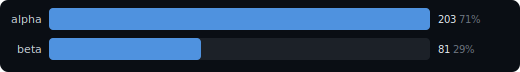

# Reponomics Dashboard

Latest data capture: 2026-05-25 12:00 UTC

<picture>
  <source media="(prefers-color-scheme: light)" srcset="docs/assets/hero-stats-light.svg">
  
</picture>

🔥 **4-day streak** above baseline (~18/d) &nbsp;·&nbsp; ⭐ Best overall day: **29 views** (yesterday) &nbsp;·&nbsp; 🏆 Best single-repo day: **`alpha`** 20 on 2026-05-24

**Growth (14d):** attention **284 views** / **174 visitors**; interest **+24 stars** / **+10 watchers** (now 170 / 40); adoption **36 clones** / **+7 forks** (now 23).

### Views Trend

<picture>
  <source media="(prefers-color-scheme: light)" srcset="docs/assets/sparkline-light.svg">
  
</picture>

### Activity

<picture>
  <source media="(prefers-color-scheme: light)" srcset="docs/assets/activity-light.svg">
  
</picture>

<strong>Top Repositories &amp; Share</strong>

<picture>
  <source media="(prefers-color-scheme: light)" srcset="docs/assets/bar-chart-light.svg">
  
</picture>

<picture>
  <source media="(prefers-color-scheme: light)" srcset="docs/assets/donut-light.svg">
  
</picture>

### Insights

- `demo/alpha` forks jumped +5 in the selected window.
- `demo/beta` views +38% over the last 6d (32 -> 44, +12).
- `demo/alpha` watchers rose +7 in the selected window.

<strong>Repositories</strong> &mdash; top 2 of 2

| Repository | Views | Visitors | Clones | Cloners |
|------------|------:|---------:|-------:|--------:|
| demo/alpha | 203 | 130 | 27 | 18 |
| demo/beta | 81 | 44 | 9 | 9 |

<strong>Repository Growth</strong> &mdash; top 2 by growth

| Repository | Attention | Interest growth | Adoption growth |
|------------|----------:|----------------:|----------------:|
| `demo/alpha` | 203 views / 130 visitors | +16 stars (120) / +7 watchers (28) | 27 clones / +5 forks (16) |
| `demo/beta` | 81 views / 44 visitors | +8 stars (50) / +3 watchers (12) | 9 clones / +2 forks (7) |

<strong>Top Referrers</strong> &mdash; 3 sources

| Referrer | Views | Uniques |
|----------|------:|--------:|
| github.com | 58 | 42 |
| google.com | 18 | 14 |
| reponomics.dev | 9 | 7 |

<strong>Popular Content</strong> &mdash; top 4 paths

| Repository | Content | Views | Uniques |
|------------|---------|------:|--------:|
| `demo/alpha` | Repository overview | 44 | 31 |
| `demo/beta` | Repository overview | 19 | 13 |
| `demo/alpha` | README | 12 | 9 |
| `demo/beta` | Issues | 7 | 5 |

---

[Setup & Docs](docs/README.md)

Generated by [Reponomics Dashboard Template](https://github.com/reponomics/reponomics-dashboard)
