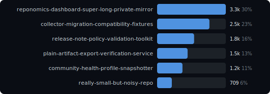

# Reponomics Dashboard

  [View latest updates](https://github.com/reponomics/reponomics-dashboard-action/releases/tag/v0.13.1)

Latest data capture: 2026-05-15 12:00 UTC

<picture>
  <source media="(prefers-color-scheme: light)" srcset="docs/assets/hero-stats-light.svg">
  
</picture>

🔥 **2-day streak** above baseline (~246/d) &nbsp;·&nbsp; ⭐ Best overall day: **279 views** (26d ago) &nbsp;·&nbsp; 🏆 Best single-repo day: **`reponomics-dashboard-super-long-private-mirror`** 83 on 2026-04-10

**Growth (14d):** attention **11,012 views** / **5,924 visitors**; interest **+12 stars** / **+3 watchers** (now 350 / 86); adoption **745 clones** / **+1 forks** (now 56).

### Views Trend

<picture>
  <source media="(prefers-color-scheme: light)" srcset="docs/assets/sparkline-light.svg">
  
</picture>

### Activity

<picture>
  <source media="(prefers-color-scheme: light)" srcset="docs/assets/activity-light.svg">
  
</picture>

<strong>Top Repositories &amp; Share</strong>

<picture>
  <source media="(prefers-color-scheme: light)" srcset="docs/assets/bar-chart-light.svg">
  
</picture>

<picture>
  <source media="(prefers-color-scheme: light)" srcset="docs/assets/donut-light.svg">
  
</picture>

### Insights

- `developer-experience/release-note-policy-validation-toolkit` views -11% over the last 7d (295 -> 263, -32).
- `enterprise-observability-labs/reponomics-dashboard-super-long-private-mirror` views -7% over the last 7d (532 -> 497, -35).
- `archive/really-small-but-noisy-repo` views -15% over the last 7d (119 -> 101, -18).

<strong>Repositories</strong> &mdash; top 6 of 6

| Repository | Views | Visitors | Clones | Cloners |
|------------|------:|---------:|-------:|--------:|
| enterprise-observability-labs/reponomics-dashboard-super-long-private-mirror | 3,309 | 1,798 | 245 | 110 |
| research-platform-team/collector-migration-compatibility-fixtures | 2,520 | 1,364 | 180 | 83 |
| developer-experience/release-note-policy-validation-toolkit | 1,783 | 959 | 117 | 45 |
| platform-infra/plain-artifact-export-verification-service | 1,470 | 787 | 98 | 42 |
| maintainer-tools/community-health-profile-snapshotter | 1,221 | 649 | 73 | 28 |
| archive/really-small-but-noisy-repo | 709 | 367 | 32 | 2 |

<strong>Repository Growth</strong> &mdash; top 6 by growth

| Repository | Attention | Interest growth | Adoption growth |
|------------|----------:|----------------:|----------------:|
| `enterprise-observability-labs/reponomics-dashboard-super-long-private-mirror` | 3,309 views / 1,798 visitors | +3 stars (56) / +1 watchers (14) | 245 clones / +0 forks (9) |
| `research-platform-team/collector-migration-compatibility-fixtures` | 2,520 views / 1,364 visitors | +3 stars (88) / +0 watchers (22) | 180 clones / +1 forks (15) |
| `developer-experience/release-note-policy-validation-toolkit` | 1,783 views / 959 visitors | +2 stars (42) / +1 watchers (10) | 117 clones / +0 forks (6) |
| `platform-infra/plain-artifact-export-verification-service` | 1,470 views / 787 visitors | +2 stars (74) / +1 watchers (19) | 98 clones / +0 forks (12) |
| `maintainer-tools/community-health-profile-snapshotter` | 1,221 views / 649 visitors | +1 stars (62) / +0 watchers (15) | 73 clones / +0 forks (10) |
| `archive/really-small-but-noisy-repo` | 709 views / 367 visitors | +1 stars (28) / +0 watchers (6) | 32 clones / +0 forks (4) |

<strong>Top Referrers</strong> &mdash; 6 sources

| Referrer | Views | Uniques |
|----------|------:|--------:|
| github.com | 987 | 610 |
| google.com | 602 | 370 |
| docs.github.com | 382 | 234 |
| news.ycombinator.com | 272 | 166 |
| reddit.com | 190 | 116 |
| stackoverflow.com | 108 | 64 |

<strong>Popular Content</strong> &mdash; top 10 paths

| Repository | Content | Views | Uniques |
|------------|---------|------:|--------:|
| `enterprise-observability-labs/reponomics-dashboard-super-long-private-mirror` | Repository overview | 297 | 172 |
| `research-platform-team/collector-migration-compatibility-fixtures` | Repository overview | 226 | 131 |
| `developer-experience/release-note-policy-validation-toolkit` | Repository overview | 160 | 92 |
| `platform-infra/plain-artifact-export-verification-service` | Repository overview | 132 | 76 |
| `enterprise-observability-labs/reponomics-dashboard-super-long-private-mirror` | README | 119 | 69 |
| `maintainer-tools/community-health-profile-snapshotter` | Repository overview | 109 | 63 |
| `research-platform-team/collector-migration-compatibility-fixtures` | README | 90 | 52 |
| `enterprise-observability-labs/reponomics-dashboard-super-long-private-mirror` | Releases | 79 | 45 |
| `enterprise-observability-labs/reponomics-dashboard-super-long-private-mirror` | Documentation | 66 | 38 |
| `developer-experience/release-note-policy-validation-toolkit` | README | 64 | 37 |

---

[Setup & Docs](docs/README.md)

Generated by [Reponomics Dashboard Template](https://github.com/reponomics/reponomics-dashboard)
