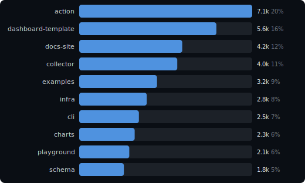

# Reponomics Dashboard

Latest data capture: 2026-05-25 12:00 UTC

<picture>
  <source media="(prefers-color-scheme: light)" srcset="docs/assets/hero-stats-light.svg">
  
</picture>

🔥 **1-day streak** above baseline (~467/d) &nbsp;·&nbsp; ⭐ Best overall day: **615 views** (35d ago) &nbsp;·&nbsp; 🏆 Best single-repo day: **`action`** 124 on 2026-04-20

**Growth (14d):** attention **38,654 views** / **21,457 visitors**; interest **+24 stars** / **+6 watchers** (now 1,183 / 317); adoption **2,919 clones** / **+3 forks** (now 206).

### Views Trend

<picture>
  <source media="(prefers-color-scheme: light)" srcset="docs/assets/sparkline-light.svg">
  
</picture>

### Activity

<picture>
  <source media="(prefers-color-scheme: light)" srcset="docs/assets/activity-light.svg">
  
</picture>

<strong>Top Repositories &amp; Share</strong>

<picture>
  <source media="(prefers-color-scheme: light)" srcset="docs/assets/bar-chart-light.svg">
  
</picture>

<picture>
  <source media="(prefers-color-scheme: light)" srcset="docs/assets/donut-light.svg">
  
</picture>

### Insights

- `reponomics/archive-reader` views -42% over the last 7d (163 -> 94, -69).
- `reponomics/schema` views +37% over the last 7d (109 -> 149, +40).
- `reponomics/cli` views spiked versus baseline (latest 43 vs trailing median 26).

<strong>Repositories</strong> &mdash; top 10 of 12

| Repository | Views | Visitors | Clones | Cloners |
|------------|------:|---------:|-------:|--------:|
| reponomics/action | 7,116 | 4,011 | 598 | 283 |
| reponomics/dashboard-template | 5,641 | 3,169 | 468 | 207 |
| reponomics/docs-site | 4,238 | 2,375 | 334 | 142 |
| reponomics/collector | 4,034 | 2,254 | 323 | 135 |
| reponomics/examples | 3,202 | 1,777 | 238 | 100 |
| reponomics/infra | 2,779 | 1,534 | 203 | 78 |
| reponomics/cli | 2,456 | 1,348 | 172 | 57 |
| reponomics/charts | 2,282 | 1,249 | 157 | 49 |
| reponomics/playground | 2,059 | 1,123 | 139 | 41 |
| reponomics/schema | 1,838 | 1,000 | 117 | 33 |

Show all 12 repositories

| Repository | Views | Visitors | Clones | Cloners |
|------------|------:|---------:|-------:|--------:|
| reponomics/action | 7,116 | 4,011 | 598 | 283 |
| reponomics/dashboard-template | 5,641 | 3,169 | 468 | 207 |
| reponomics/docs-site | 4,238 | 2,375 | 334 | 142 |
| reponomics/collector | 4,034 | 2,254 | 323 | 135 |
| reponomics/examples | 3,202 | 1,777 | 238 | 100 |
| reponomics/infra | 2,779 | 1,534 | 203 | 78 |
| reponomics/cli | 2,456 | 1,348 | 172 | 57 |
| reponomics/charts | 2,282 | 1,249 | 157 | 49 |
| reponomics/playground | 2,059 | 1,123 | 139 | 41 |
| reponomics/schema | 1,838 | 1,000 | 117 | 33 |
| reponomics/archive-reader | 1,574 | 847 | 89 | 25 |
| reponomics/release-tools | 1,435 | 770 | 81 | 23 |

<strong>Repository Growth</strong> &mdash; top 10 by growth

| Repository | Attention | Interest growth | Adoption growth |
|------------|----------:|----------------:|----------------:|
| `reponomics/docs-site` | 4,238 views / 2,375 visitors | +3 stars (107) / +1 watchers (29) | 334 clones / +1 forks (19) |
| `reponomics/action` | 7,116 views / 4,011 visitors | +3 stars (47) / +1 watchers (13) | 598 clones / +0 forks (8) |
| `reponomics/dashboard-template` | 5,641 views / 3,169 visitors | +3 stars (99) / +1 watchers (27) | 468 clones / +0 forks (17) |
| `reponomics/collector` | 4,034 views / 2,254 visitors | +2 stars (84) / +0 watchers (22) | 323 clones / +1 forks (15) |
| `reponomics/examples` | 3,202 views / 1,777 visitors | +2 stars (115) / +1 watchers (31) | 238 clones / +0 forks (20) |
| `reponomics/release-tools` | 1,435 views / 770 visitors | +2 stars (144) / +1 watchers (39) | 81 clones / +0 forks (25) |
| `reponomics/infra` | 2,779 views / 1,534 visitors | +2 stars (125) / +0 watchers (33) | 203 clones / +0 forks (22) |
| `reponomics/charts` | 2,282 views / 1,249 visitors | +2 stars (58) / +0 watchers (15) | 157 clones / +0 forks (10) |
| `reponomics/playground` | 2,059 views / 1,123 visitors | +1 stars (134) / +0 watchers (36) | 139 clones / +1 forks (24) |
| `reponomics/schema` | 1,838 views / 1,000 visitors | +2 stars (156) / +0 watchers (42) | 117 clones / +0 forks (27) |

<strong>Top Referrers</strong> &mdash; 6 sources

| Referrer | Views | Uniques |
|----------|------:|--------:|
| github.com | 2,855 | 1,768 |
| google.com | 1,743 | 1,078 |
| docs.github.com | 1,108 | 683 |
| news.ycombinator.com | 790 | 486 |
| reddit.com | 551 | 337 |
| stackoverflow.com | 314 | 190 |

<strong>Popular Content</strong> &mdash; top 10 paths

| Repository | Content | Views | Uniques |
|------------|---------|------:|--------:|
| `reponomics/action` | Repository overview | 640 | 371 |
| `reponomics/dashboard-template` | Repository overview | 507 | 294 |
| `reponomics/docs-site` | Repository overview | 381 | 220 |
| `reponomics/collector` | Repository overview | 363 | 210 |
| `reponomics/examples` | Repository overview | 288 | 167 |
| `reponomics/action` | README | 256 | 148 |
| `reponomics/infra` | Repository overview | 250 | 145 |
| `reponomics/cli` | Repository overview | 221 | 128 |
| `reponomics/charts` | Repository overview | 205 | 118 |
| `reponomics/dashboard-template` | README | 203 | 117 |

---

[Setup & Docs](docs/README.md)

Generated by [Reponomics Dashboard Template](https://github.com/reponomics/reponomics-dashboard)
