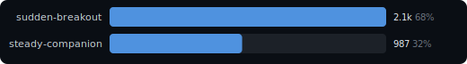

# Reponomics Dashboard

<!-- Workflow badge hidden pending a deliberate dashboard status design. -->
<!--

-->

  [View latest updates](https://github.com/reponomics/reponomics-dashboard-action/releases/tag/v0.13.1)

Latest data capture: 2026-05-29 12:00 UTC

<picture>
  <source media="(prefers-color-scheme: light)" srcset="docs/assets/hero-stats-light.svg">
  
</picture>

🔥 **2-day streak** above baseline (~24/d) &nbsp;·&nbsp; ⭐ Best overall day: **497 views** (21d ago) &nbsp;·&nbsp; 🏆 Best single-repo day: **`sudden-breakout`** 484 on 2026-05-08

**Growth (14d):** attention **3,047 views** / **1,811 visitors**; interest **+2 stars** / **+0 watchers** (now 79 / 20); adoption **334 clones** / **+1 forks** (now 13).

### Views Trend

<picture>
  <source media="(prefers-color-scheme: light)" srcset="docs/assets/sparkline-light.svg">
  
</picture>

### Activity

<picture>
  <source media="(prefers-color-scheme: light)" srcset="docs/assets/activity-light.svg">
  
</picture>

<strong>Top Repositories &amp; Share</strong>

<picture>
  <source media="(prefers-color-scheme: light)" srcset="docs/assets/bar-chart-light.svg">
  
</picture>

<picture>
  <source media="(prefers-color-scheme: light)" srcset="docs/assets/donut-light.svg">
  
</picture>

### Insights

- `demo/sudden-breakout` views +4% over the last 7d (90 -> 94, +4).
- `demo/steady-companion` clones +10% over the last 7d (10 -> 11, +1).

<strong>Repositories</strong> &mdash; top 2 of 2

| Repository | Views | Visitors | Clones | Cloners |
|------------|------:|---------:|-------:|--------:|
| demo/sudden-breakout | 2,060 | 1,271 | 199 | 81 |
| demo/steady-companion | 987 | 540 | 135 | 90 |

<strong>Repository Growth</strong> &mdash; top 2 by growth

| Repository | Attention | Interest growth | Adoption growth |
|------------|----------:|----------------:|----------------:|
| `demo/sudden-breakout` | 2,060 views / 1,271 visitors | +1 stars (46) / +0 watchers (12) | 199 clones / +1 forks (8) |
| `demo/steady-companion` | 987 views / 540 visitors | +1 stars (33) / +0 watchers (8) | 135 clones / +0 forks (5) |

<strong>Top Referrers</strong> &mdash; 6 sources

| Referrer | Views | Uniques |
|----------|------:|--------:|
| github.com | 273 | 168 |
| google.com | 167 | 103 |
| docs.github.com | 106 | 65 |
| news.ycombinator.com | 75 | 45 |
| reddit.com | 53 | 32 |
| stackoverflow.com | 29 | 17 |

<strong>Popular Content</strong> &mdash; top 10 paths

| Repository | Content | Views | Uniques |
|------------|---------|------:|--------:|
| `demo/sudden-breakout` | Repository overview | 185 | 107 |
| `demo/steady-companion` | Repository overview | 88 | 51 |
| `demo/sudden-breakout` | README | 74 | 42 |
| `demo/sudden-breakout` | Releases | 49 | 28 |
| `demo/sudden-breakout` | Documentation | 41 | 23 |
| `demo/steady-companion` | README | 35 | 20 |
| `demo/sudden-breakout` | Issues | 28 | 16 |
| `demo/steady-companion` | Releases | 23 | 13 |
| `demo/steady-companion` | Documentation | 19 | 11 |
| `demo/steady-companion` | Issues | 13 | 7 |

---

[Setup & Docs](https://github.com/reponomics/reponomics-dashboard/blob/main/docs/reponomics/README.md)

Generated by [Reponomics Dashboard Template](https://github.com/reponomics/reponomics-dashboard)
