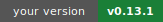
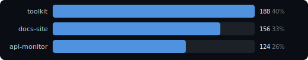

# Reponomics Dashboard

<!-- Workflow badge hidden pending a deliberate dashboard status design. -->
<!--

-->

  [View latest updates](https://github.com/reponomics/reponomics-dashboard-action/releases/tag/v0.13.1)

Latest data capture: 2026-06-08 12:00 UTC

> **GitHub traffic data is behind:** latest collection is 2026-06-11, but traffic is reported through 2026-06-08 (3 day gap) across 3 repositories. Missing trailing dates are unreported, not zero traffic.

<picture>
  <source media="(prefers-color-scheme: light)" srcset="docs/assets/hero-stats-light.svg">
  
</picture>

🔥 **4-day streak** above baseline (~57/d) &nbsp;·&nbsp; ⭐ Best overall day: **69 views** (today) &nbsp;·&nbsp; 🏆 Best single-repo day: **`toolkit`** 27 on 2026-06-08

**Growth (14d):** attention **468 views** / **216 visitors**; interest **+0 stars** / **+0 watchers** (now 105 / 24); adoption **72 clones** / **+0 forks** (now 15).

### Views Trend

<picture>
  <source media="(prefers-color-scheme: light)" srcset="docs/assets/sparkline-light.svg">
  
</picture>

### Activity

<picture>
  <source media="(prefers-color-scheme: light)" srcset="docs/assets/activity-light.svg">
  
</picture>

<strong>Top Repositories &amp; Share</strong>

<picture>
  <source media="(prefers-color-scheme: light)" srcset="docs/assets/bar-chart-light.svg">
  
</picture>

<picture>
  <source media="(prefers-color-scheme: light)" srcset="docs/assets/donut-light.svg">
  
</picture>

### Insights

- `demo/toolkit` drew 188 views and 88 visitors without downstream growth in the selected window.
- `demo/docs-site` drew 156 views and 72 visitors without downstream growth in the selected window.
- `demo/api-monitor` drew 124 views and 56 visitors without downstream growth in the selected window.

<strong>Repositories</strong> &mdash; top 3 of 3

| Repository | Views | Visitors | Clones | Cloners |
|------------|------:|---------:|-------:|--------:|
| demo/toolkit | 188 | 88 | 32 | 24 |
| demo/docs-site | 156 | 72 | 24 | 16 |
| demo/api-monitor | 124 | 56 | 16 | 8 |

<strong>Repository Growth</strong> &mdash; top 3 by growth

| Repository | Attention | Interest growth | Adoption growth |
|------------|----------:|----------------:|----------------:|
| `demo/toolkit` | 188 views / 88 visitors | +0 stars (46) / +0 watchers (11) | 32 clones / +0 forks (7) |
| `demo/docs-site` | 156 views / 72 visitors | +0 stars (35) / +0 watchers (8) | 24 clones / +0 forks (5) |
| `demo/api-monitor` | 124 views / 56 visitors | +0 stars (24) / +0 watchers (5) | 16 clones / +0 forks (3) |

<strong>Top Referrers</strong> &mdash; 6 sources

| Referrer | Views | Uniques |
|----------|------:|--------:|
| github.com | 41 | 23 |
| google.com | 24 | 13 |
| docs.github.com | 15 | 8 |
| news.ycombinator.com | 10 | 4 |
| reddit.com | 7 | 3 |
| stackoverflow.com | 3 | 3 |

<strong>Popular Content</strong> &mdash; top 10 paths

| Repository | Content | Views | Uniques |
|------------|---------|------:|--------:|
| `demo/toolkit` | Repository overview | 16 | 9 |
| `demo/docs-site` | Repository overview | 14 | 8 |
| `demo/api-monitor` | Repository overview | 11 | 6 |
| `demo/toolkit` | README | 6 | 3 |
| `demo/docs-site` | README | 5 | 2 |
| `demo/toolkit` | Releases | 4 | 2 |
| `demo/api-monitor` | README | 4 | 2 |
| `demo/toolkit` | Documentation | 3 | 1 |
| `demo/docs-site` | Releases | 3 | 1 |
| `demo/docs-site` | Documentation | 3 | 1 |

---

[Setup & Docs](https://github.com/reponomics/reponomics-dashboard/blob/main/docs/reponomics/README.md)

Generated by [Reponomics Dashboard Template](https://github.com/reponomics/reponomics-dashboard)
